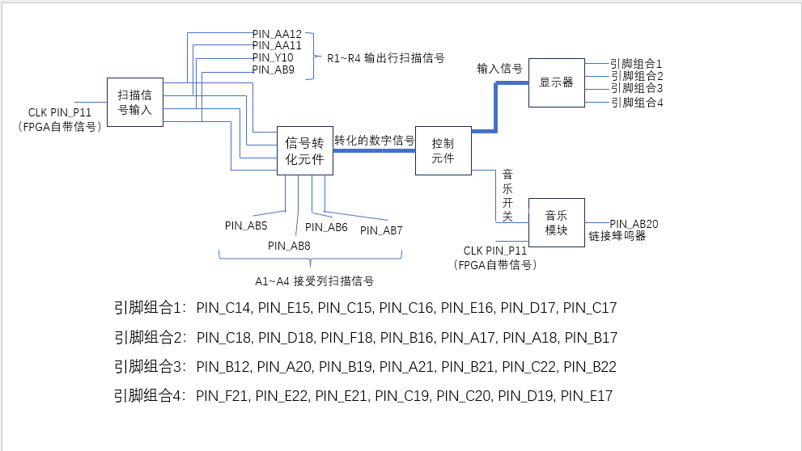
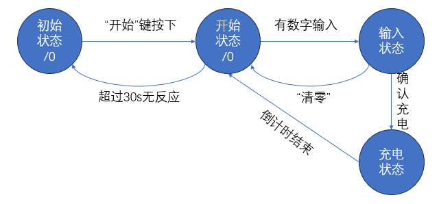
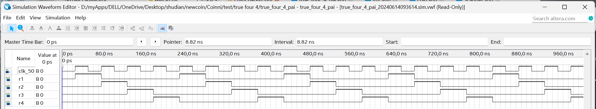
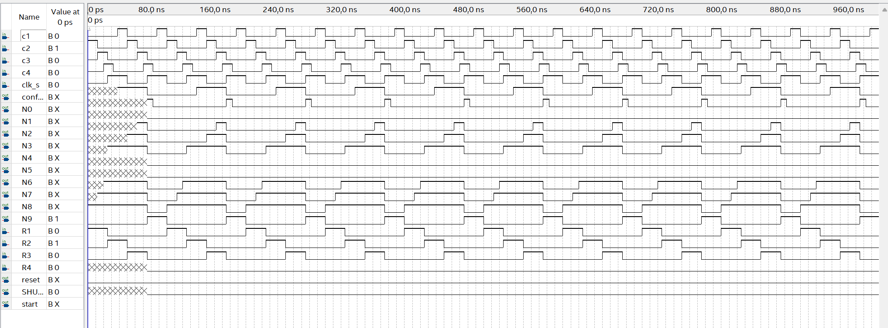
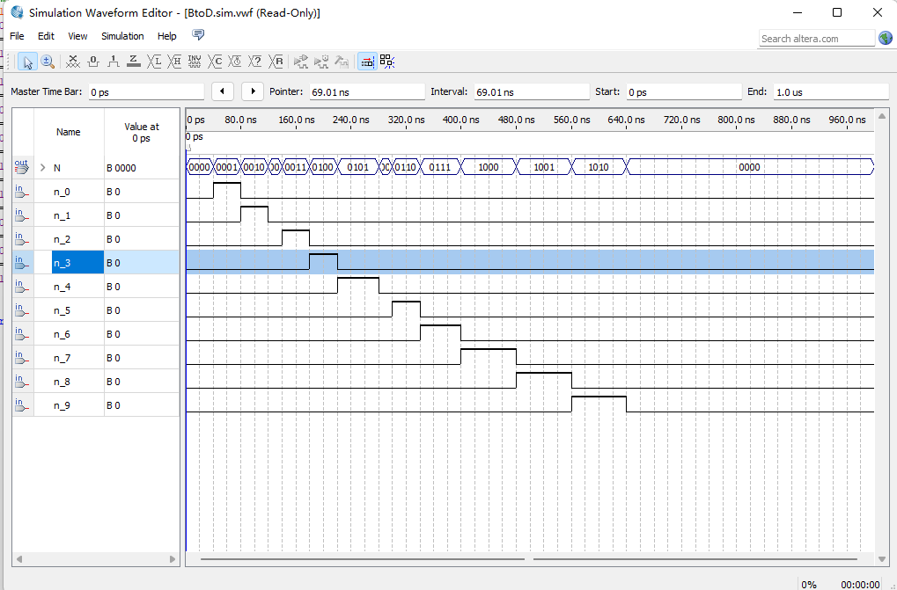
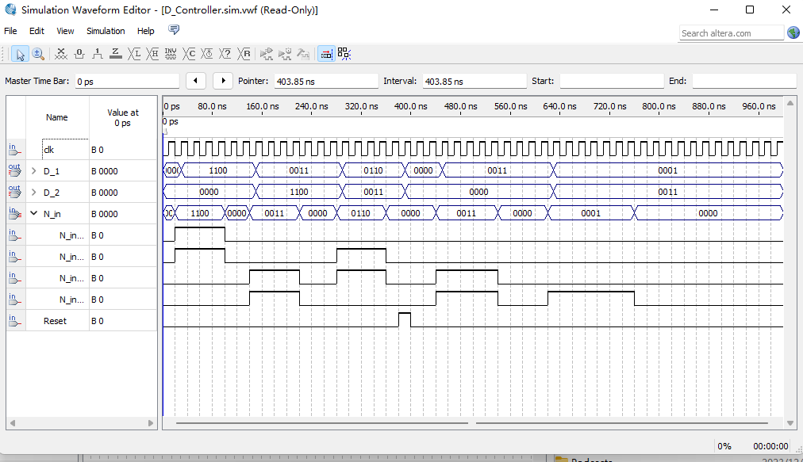
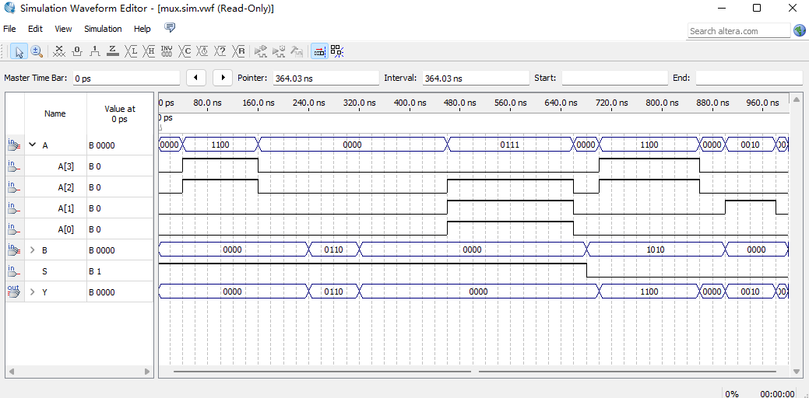
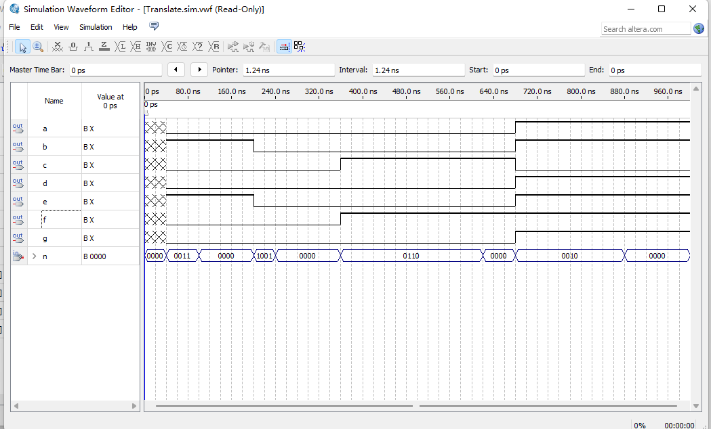
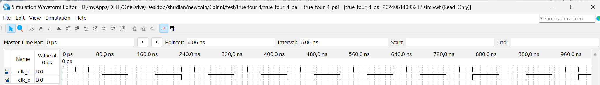
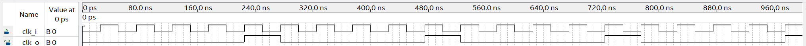

# 预习报告

## 任务要求分析

### 基础元件部分
#### 1. 分频器

将时钟信号分割成需要的频率。
#### 2. 显示器

将数字信号转换为晶体管上的光信号，即翻译为可见的数字。

### 功能元件部分

#### 键盘信号识别部分

##### 1. 按行扫描信号。

依次为每行提供电信号，且该信号应当在手按下按钮的时间之内扫描所有行。

##### 2. 信号转化元件。

当a行b列被按下时，信号在扫描到a行后，b列的开关打开，信号输出对应的数字，即可得a行b列被按下。

##### 3. 按键防抖功能。

防止按下按键后不断识别同一个数字导致键盘输出出现故障。

#### 控制元件

##### 1. 识别键盘信号并进行处理。

处理内容包括输出充电电量（与显示器链接）、确认是否开始输入/充电、是否清零，即将前文所述信号转化元件的输出信号转换为相应的实现。

##### 2. 时间计算器。

功能为计算充电时间（包括判断输入是否大于20）、进行倒计时（包括是否回到初始状态、是否充电结束）

#### 蜂鸣器驱动部分
##### 1. 音乐储存元件。

根据键盘元件给的启动信号，判断是否启动；

储存预计播放的音乐，根据音调对已有电压频率进行分频。

## 电路总体框图

## 状态转换图

如图所示，状态转换图中，各状态描述如下：

### 初始状态时
数码管显示全灭，等待开始键按下后，进入开始状态

### 开始状态时
数码管显示“0000”

若超过30s无数字输入，回到初始状态

若有数字输入，进入输入状态

### 输入状态
若输入状态按下“清零”，进入开始状态

若按下数字，则只取“确认”键按下前所有输入的最后2位，即“移位输出”。

同时，两个数码管分别显示硬币数量和充电时间，当输入硬币数量大于20时，显示为20。

### 充电状态

若输入完后按下充电，进入充电状态。

硬币数量不变但充电时间根据clk输出逐渐减少，当充电时间为0时，回归开始状态。

同时，当充电时间为0时，开始播放音乐，10~15s后停止或再次按下数字后停止。

# 设计思路

## 键盘和显示部分设计思路

数据的输入、控制的实现以及终端数码管的显示都由此模块实现。根据要求，这个模块的功能包括以下详细的内容：

### 数据输入

数据的输入物理上通过键盘来实现，因此我们需要完成​**扫描键盘的驱动**​和​**键位绑定**​两个部分。这两个部分可以进一步拆分成下面这些更简单的元件。

1.  扫描信号发生器-Scanner

    这个元件能接收时钟信号，使四个端口依次为1，实现扫描信号的产生。对于每一个端口，扫描的频率即是输入信号的1/4。实现时用一个计数器来触发每一个端口的信号以及重置即可。

2.  键盘和键位绑定-keyboard

    这个元件会接收扫描键盘的扫描信号（列），产生行列信号的二进制输出。我们将行列坐标绑定到表示数字的十个二进制端口以及start等控制信号上。
    同时，为了实现要求中的30秒无输入自动关机的功能，我们为这个元件接入了一个秒级时钟和受到键盘输入控制的计数器。当键盘有任何输入，这个计数器就会清零。如果30秒没有输入，元件就会输出关机信号。

### 数据的预处理

键盘上的行列信号虽然已经转换成了​**10位二进制**​信号，但这仍然不利于元件的编写。因此我们对信号进行一定的预处理。

1.  10位二进制转4位总线-BtoD

    这个元件将来自键盘的10位二进制信号​**编码后**​转换成4位总线信号。这个编码规则是将10位二进制信号中1所在的位数转换成4位二进制数之后加1 ，目的在于将0000视为无信号,便于后续逻辑的处理。

### 控制

1.  移位寄存器-D​\_​Controller

    这个元件能够移位地储存和输出数据。

2.  倒计时-DisCounter

    这个元件用来实现倒计时逻辑。他会接收来自移位寄存器的数据并在​**按下确认键之后**​，输出倒计时的数据。本元件会在内部进行逻辑判断，保证实现​**大于40s则按40s输出**​。元件接入了一个秒级时钟来实现倒计时控制。

### 终端显示

1.  4位总线转数码管输出-Translate

    这个元件直接将4位总线的输入解码成为数码管控制信号，用于终端控制。

### 分频器-Timer

上述的元件需要不同周期的时钟信号，Timer将实现把将芯片默认的50MHZ信号转换成1HZ信号和50HZ信号输出。

## 辅助元件

由于实际上各个部件受到彼此控制，逻辑上也存在选择、先后关系，输出信号的时域形式也并不总是符合另一个元件的输入要求，因此为了完成整体电路的搭建，我们还设计了以下元件：

1.  总线数据选择器-mux

    这个元件会根据选择信号来决定允许哪个总线信号得以通过。

2.  信号转换-switch

    由于VHDL语言的限制，边沿触发并不总是有效，我们往往需要将脉冲、阶跃、上升沿转换成一个恒定的信号。

## 蜂鸣器部分

### CHARGE_MUSIC_PLAY
本元件主要实现以下功能：

- 将输入信号根据节拍转化为分频器的分频依据（称为N_i）
- 根据音乐节拍和简谱储存音乐，每接收到一个上升沿就输出下一个音符。

### M1

本元件为分频器，主要用于将输入频率25分频

###  To2

本原件为分频器，主要用于将输入2分频

### ture_four_4_pai

分频器，主要用于将信号4分频

### Coin

分频器，根据前端N_i接收到的分频依据对蜂鸣器的输入信号进行分频

# 仿真波形及其分析说明

## 键盘和显示部分仿真

### 扫描信号发生器-Scanner

输入时钟后，依次在各个端口(r1-r4)输出一个周期的高电平信号。
本元件功能正常可用。

### 键盘和键位绑定-keyboard

波形中为r1-r4输入了扫描信号，并且给了随机的C1-C4信号。经检查输出与给定的按键绑定相符。
本元件功能正常可用。

### 10位二进制转4位总线-BtoD

输入信号为10位二进制信号，对应十进制数，输出N为4位总线信号，已经编码。
本元件功能正常可用。

### 移位寄存器-D​\_​Controller

随机输入，得到了移位的正确输出结果，且元件能够实现存储，复位功能正常。
本元件功能正常可用。

### 数据选择器-mux

随机设定总线输入的值，在S=1时选择B输出，而在S=0时选择A输出。
本元件功能正常可用。

### 4位总线转数码管输出-Translate

随机给定总线输入，数码管控制对应正确。
本元件功能正常可用。

## 音频部分仿真

音频部分元件（如音乐储存器）频率较低，不易仿真，因此不在此处列出仿真结果
### 分频器—二分频-TO2

输入信号2次后输出1次，占空比为50%
本元件功能正常可用

### 分频器—四分频-true-for-4

输入信号4次后输出1次，占空比为25%
本元件功能正常可用

# 设计和调试中遇到的问题及其解决方法

## 无法启动

### 问题

起初的设计中我们通过用键盘输出的关机信号来控制一个数据选择器，从而控制时钟是否接入整个电路而尝试实现开机、自动关机的功能。但是实际上在未开机的时候，没有时钟信号的键盘根本无法检测到开机键的输入，因此无法启动。

### 解决办法

在键盘输出后的编码端之后加入由开机键控制的数据选择器，这样键盘部分总是在工作。

## 数据传输

### 问题

编程时使用十进制数进行比较、运算、递归都很方便，但在完成了元件生成之后，十进制数据的使用带来了以下麻烦:

-   十进制数在电路中实际上以总线形式传递，导致元件之间的端口类型不同，无法连接
-   VHDL 并不存在​**null**​类型的数据，因此要表达无输入非常麻烦

### 解决办法

-   统一使用4位2进制总线传输数据
-   定义了特殊的编码

## 软件报错

### 问题

Qutars中自带的仿真软件和编译环境可靠性不尽如人意，往往在一台设备上能够编译、能够仿真的文件到了另一台设备就会出现问题，甚至在同一台设备的不同时间也无法统一表现。试图解决bug、挽救未保存的工作等与生产力无关的事项常常耗费很多时间。

### 解决方法

统一使用实验室的电脑进行编译、仿真，不在Qutars内部进行编辑。

